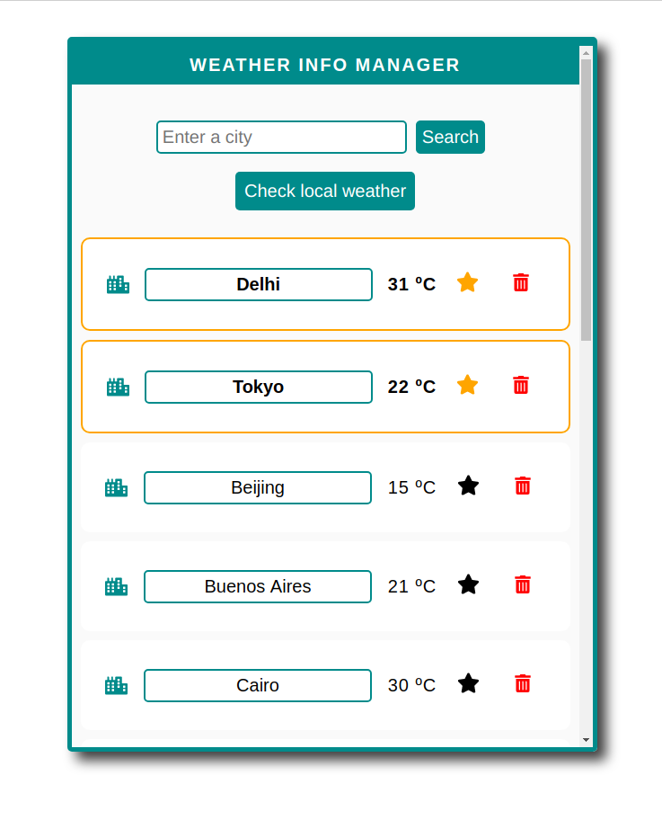
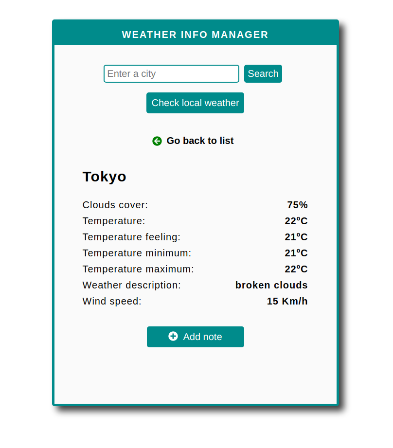
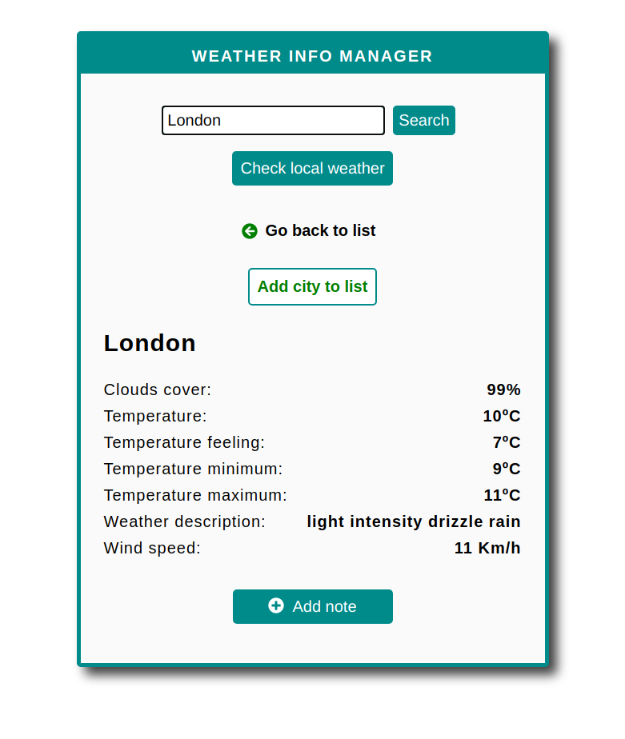
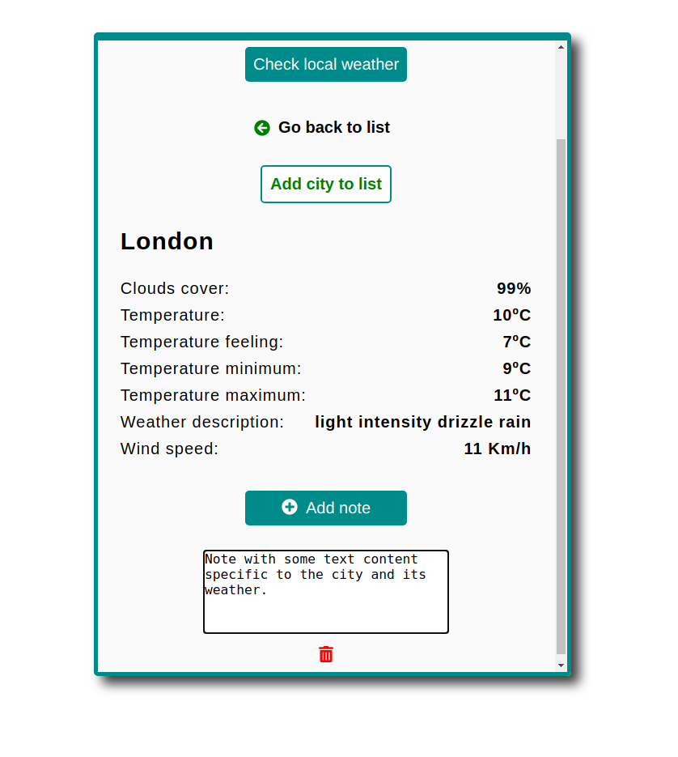

# Weather Info Manager

Progressive web app made with TypeScript and React to track the weather in different cities.  
Some of its features are:  

* Initial list of top 15 cities by population, sorted alphabetically
* Add / Remove cities from the list
* Search by city name and get current weather for the location
* Details view with additional weather information
* Get weather for user's current location
* Add / update / delete notes per city
* Data persisted via localStorage API
* Mark / unmark cities as favorite
* PWA expected offline functionality (Only the hosted version, makes local development wasteful)

## Running the app locally

* Clone the repo
* Create a .env file in the root of the project
* Add to the file `REACT_APP_WEATHER_API_ID=placeholder`
* Replace `placeholder` with your openweathermap key (One was provided by email)
* Save the file
* `npm install`
* `npm start`

To run the tests:
* `npm test`

It will generate a coverage report in the coverage folder, open the index.html file with your browser to check it.

## Live version: https://weather-info-manager.herokuapp.com/

## Home page

## Details view

## Search results

## Notes

